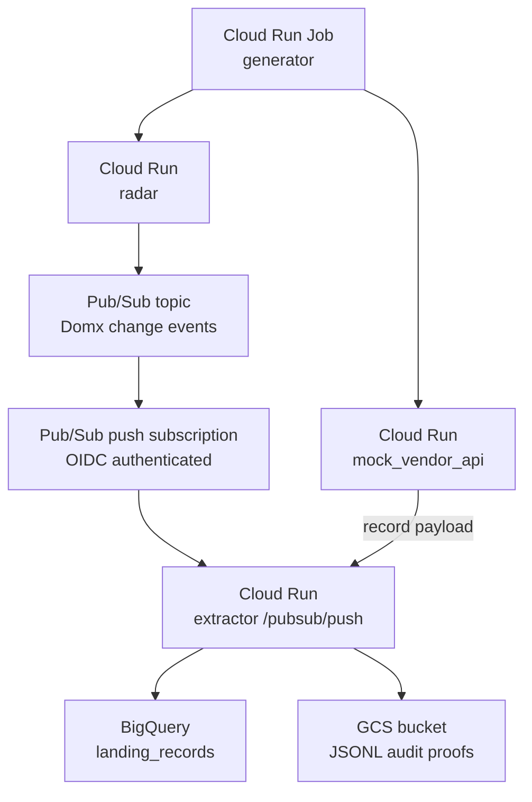

# GCP Cloud Run Deployment

This POC can run in GCP with the same business flow as the local Docker Compose demo:



Terraform is the source of truth for cloud resources. The helper scripts wrap the boring parts: create the Artifact Registry repo, build/push the image, apply Terraform, execute the generator job, query BigQuery, and list the GCS audit proof files.

The same operations are exposed as manual GitHub Actions for deploy, restart, and teardown. See [github-actions.md](github-actions.md).

## Prerequisites

- A GCP project with billing enabled.
- `gcloud auth login` completed.
- `gcloud auth application-default login` completed if Terraform needs ADC locally.
- Docker running locally.
- Terraform installed.

## Deploy

```bash
PROJECT_ID="your-project-id" ./scripts/gcp/deploy.sh
```

Optional environment variables:

```bash
REGION="europe-west1"
NAME_PREFIX="domx-ingestion-poc"
RUN_SMOKE_TEST="1"
GENERATOR_COUNT="15"
AUDIT_BATCH_MIN_MESSAGES="15"
CLOUD_RUN_MIN_INSTANCES="1"
```

The deploy script writes two ignored local files:

- `deploy/gcp/terraform/terraform.tfvars`
- `.gcp-deployment.env`

## Smoke Test

Run the generator job, query the BigQuery landing table, and list the GCS proof files:

```bash
GENERATOR_COUNT="150" ./scripts/gcp/smoke_test.sh
```

The expected result is at least 15 landed records, a recent `latest_extracted_at` timestamp, and at least one object under `gs://BUCKET/ingestion-audit/`.

The generator is intentionally a Cloud Run Job, not a service. In the real vendor flow, `radar` is passive and only publishes events when a vendor webhook arrives. In the demo, execute the generator job whenever you want a new batch of synthetic Domx changes. `GENERATOR_COUNT` overrides the job execution count for that run without redeploying Terraform.

## Always-On Behavior

The default deployment keeps one warm instance for each Cloud Run service so the demo looks alive until the killswitch is run. For lower cost, set:

```bash
CLOUD_RUN_MIN_INSTANCES="0"
```

That keeps the service deployed but lets Cloud Run scale containers down to zero between requests.

## Status

```bash
./scripts/gcp/status.sh
```

## Restart

Roll the Cloud Run services without changing business logic:

```bash
./scripts/gcp/restart.sh
```

This updates a `RESTARTED_AT` environment variable on the radar, extractor, and mock vendor API services, creating fresh Cloud Run revisions. By default it also runs the same 15-message smoke test.

## Killswitch

Destroy the Terraform-managed GCP resources:

```bash
./scripts/gcp/killswitch.sh
```

Use this after demos. The Terraform resources are configured with Cloud Run deletion protection off and BigQuery dataset contents destroyable so the teardown path is intentionally direct.

## What Terraform Creates

- Artifact Registry Docker repository.
- Service accounts for radar, extractor, generator, and Pub/Sub push.
- Cloud Run services:
  - `domx-ingestion-poc-radar`
  - `domx-ingestion-poc-extractor`
  - `domx-ingestion-poc-mock-vendor-api`
- Cloud Run Job:
  - `domx-ingestion-poc-generator`
- Pub/Sub topic and authenticated push subscription.
- BigQuery dataset and partitioned `landing_records` table.
- GCS bucket for JSONL ingestion audit proof files.
- IAM grants needed for Pub/Sub publishing, Pub/Sub push invocation, BigQuery writes, and GCS audit proof writes.

## Webhook Shape

Radar accepts Domx-style trigger webhooks:

```text
POST https://RADAR_URL/webhooks/domx
```

```json
{
  "vendor_record_id": "domx-123",
  "event_type": "record.changed",
  "payload_ref": "/records/domx-123"
}
```
