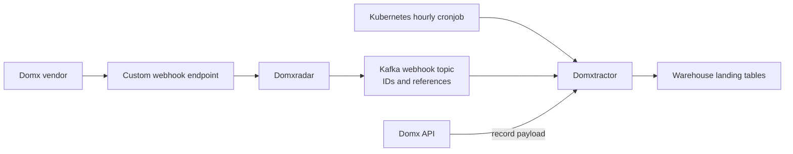
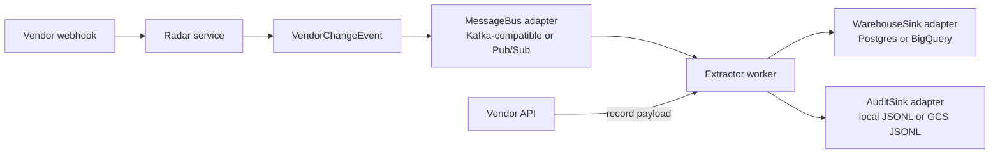
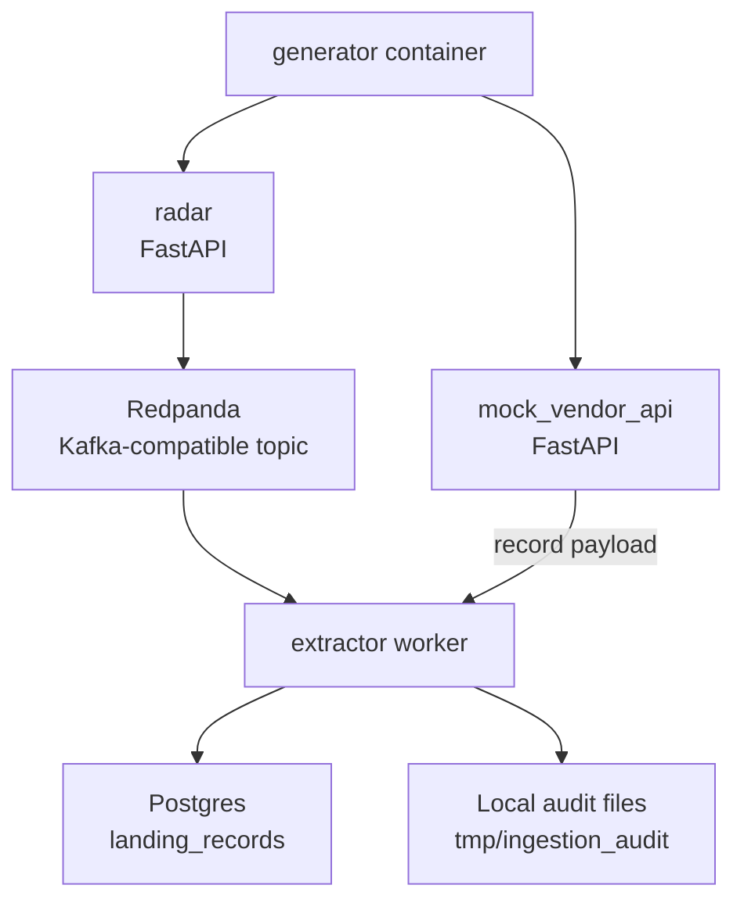
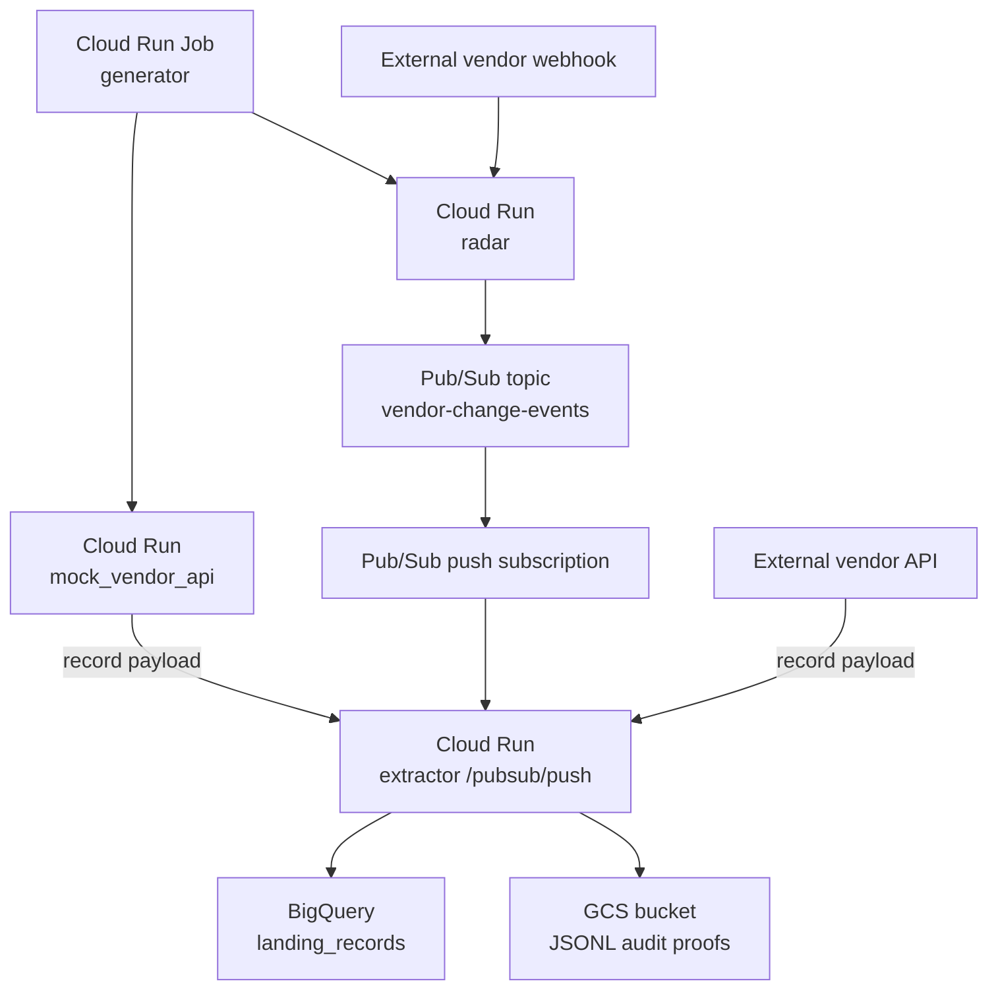
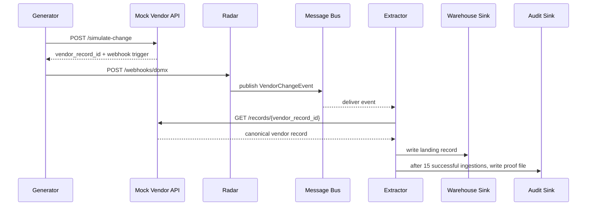

# Event-Driven Vendor Ingestion Architecture

This POC is intentionally evolutionary. It keeps the radar/extractor split that already exists, then changes when extraction happens: immediately after a change event, not on an hourly cron schedule.

## Current Domx-Style Batch Flow



## Proposed Event-Driven Flow



The webhook remains a trigger. It says "record X changed." The extractor uses that trigger to fetch the canonical data from the vendor API right away.

## Local Demo Deployment



Run it with:

```bash
docker compose up --build
```

## GCP Cloud Run Deployment



Cloud Run is the primary GCP target because it keeps the demo small: no cluster, no cron controller, and clear scaling semantics.

## One Change Sequence



## Why This Is Easier To Sell

- The team does not need to throw away radar/extractor terminology.
- Kafka remains supported locally and for any Kafka-compatible deployment.
- GCP Pub/Sub is the recommended managed path for Cloud Run.
- The event schema makes vendor-specific webhooks look the same downstream.
- The audit proof files give the team a concrete trail of successfully ingested messages.
- The live generator makes latency and throughput visible in a meeting.
